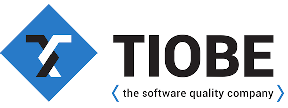

# TIOBE Index Ratings

**Index Ratings for Popular Programming Languages from TIOBE**

<!--  -->

TIOBE Index Rating (more formally, TIOBE Programming Community Index) is an indicator for measurement of the programming languages' popularity. It gets updated once every month (although the dates are not regular). 

The ratings are based on the number of talented engineers world-wide, courses and 3rd party vendors. To calculate the ratings, 25 search engines (e.g. Google, Bing, Yahoo!, Baidu) are also used. In order to qualify a language, it must have its own Wikipedia entry; the explanations must be stated clearly for being a programming language. Furthermore, it should be "Turing complete" and have at least 5000 hits for "language programming" for Google.
  
According to the authorities, this index is NOT an indication for the best programming language. Rather, it is a helpful measurement to choose the language strategically for software development.

## Source

All the datasets presented here are taken from this web site. Click the link for more information: https://www.tiobe.com/tiobe-index/

## IMPORTANT!

_I have no collaboration or contract with TIOBE company! I'm an independent data scientist who find these ratings data about many programming languages so intriguing and that's why, I've been managing this repo for several years. As you can guess, new ratings are published every month, and collect them here for easier access and better interpretation. Hopefully, I can broadcast these information to enthusiast programmer audience._

## Datasets

There are **two** main types of datasets available: 

**FIRST TYPE** contains all the ratings for popular programming languages, starting from June 2001. Surely, new lines are inserted when a new index rating is published monthly. New languages might be added later as inidividual columns once they've made to the top 20.

**SECOND TYPE** shows the ratings for top 20 programming languages that were presented to the monthly index list, starting from **September 2020** up to the latest month individually. Naturally, new ones will exist as separate datasets in monthly basis. After some time, the lists from the previous years are grouped together in their belonging directories. 

All rating values are carefully fetched by examining the graphical plots of all aforementioned programming languages.

Furthermore, there exist sub-types in this repo: **Very Long Term History** contains the rankings of popular programming languages according to the index as 5-year intervals (two versions for year 2023 and 2025, respectively) and **Programming Language of the Year** represents the list of programming languages entered the hall of fame by having the highest rise in ratings every year, since 2003.

## Analyses

Currently, there are two analyeses available: **January 2023** & **November 2020**. 

Click on the corresponding notebook file (.ipynb) above to inspect and see how the ratings for many programming languages have been changed in time: 

**Tiobe_Index_Ratings_(Jan2023).ipynb** or **Tiobe_Index_Ratings_(Nov2020).ipynb**.

## Languages Being Tracked
  
In this repo, currently a total of 32 programming languages are being tracked monthly (starting from September 2020):
  
* `C`
* `Java`
* `Python`
* `C++`
* `C#`
* `Visual Basic`
* `JavaScript`
* `PHP`
* `R`
* `SQL`
* `Go`
* `Swift`
* `Perl`
* `Assembly Language`
* `Ruby`
* `MATLAB`
* `Groovy`
* `Rust`
* `Objective-C`
* `Dart`
* `Classic Visual Basic` (since October 2020)
* `PL/SQL` (since October 2020)
* `Delphi/Object Pascal` (since November 2020)
* `Transact-SQL` (since November 2020)
* `Fortran` (since April 2021)
* `Prolog` (since August 2021)
* `Lua` (since March 2022)
* `Scratch` (since October 2022)
* `COBOL` (since July 2023)
* `Julia` (since August 2023)
* `Kotlin` (since September 2023)
* `Ada` (since March 2025)

## HEADLINES

### January 2026: C# is programming language of the year 2025

For the second time in three years, C# has been named Programming Language of the Year by the TIOBE Index. C# earned this distinction by achieving the largest-year-over-year increase in ranking. Over the years, the language has undergone fundamental changes. From a language-design perspective, C# has often been an early adopter of new trends among mainstream languages. At the same time, it successfully made two major paradigm shifts: from Windows-only to cross-platform, and from Microsoft-owned to open source. C# has consistently evolved at the right moment.

For many years now, there has been a direct battle between Java and C# for dominance in the busines software market. I always assumed Java would evetually prevail, but after all this time the contest remains undecided. It is an open question whether Java - with its verbose, boilerplate-heavy style and Oracle ownership - can continue to keep C# at bay.

There were also some interesting movements in the 2025 top 10. C and C++ swapped positions. Although C++ is evolving faster than ever, some of its more radical changes - such as the modules concept - have yet to see widespread industry adoption. Meanwhile, C remains simple, fast, and extremely well suited to the ever-growing market of small embedded systems. Even Rust has struggled to penetrate this space, despite reaching an all-time high of position #13 this month.

So who were the other winners of 2025, besides C#? Perl made a surprising comeback, jumping from position #32 to #11 and re-entering the top 20. Another language returning to the top 10 is R, driven largely by continued growth in data science and statistical computing.

Of course, where there are winners, there are also losers. Go appears to have permanently lost its space in the top 10 during 2025. The same seems true for Ruby, which fell out of the top 20 and is unlikely to return anytime soon.

What can we expect from 2026? I have a long history of making incorrect predictions, but I suspect that TypeScript will finally break into the top 20. Additionally, Zig, which climbed from position #61 to #42 in 2025, looks like a strong candidate to enter the TIOBE top 30.

What changes do you foresee in 2026? _(Paul Jensen - Chief Executive Officer)_

### December 2025: Programming language R is back in the top 10

Programming language R is known for fitting statisticians and data scientists like a glove. As statistics and large-scale data visualization become increasingly important, R has regained popularity. This trend is, for instance, also reflected in the rise of Wolfram/Mathematica (another tool with similar capabilities) which re-enabled the top 50 this month.

R is sometimes frowned upon by "traditional" software engineers due to its unconventional syntax and limited scalability for large production systems. But for domain experts, it remains a powerful and elegant tool. R continues to thrive at universities and in research-driven industries.

In the recent past, R and Python were often framed as competitors, a contest Python ultimately won in terms of general adoption. Yet R has carved out a solid and enduring niche. It excels at rapid experimentation, statistical modelling, and exploratory data analysis. We have seen many TIOBE index top 10 entrants rising and falling. It will be interesting to see whether R can maintain its current position.

Other interesting news: next month we will announce the TIOBE Programming Language of the Year 2025. At the moment, C# appears to be the strongest candidate for this title. _(Paul Jensen - Chief Executive Officer)_

### November 2025: Is C# going to surpass Java for the first time in history?

Until recently, nobody could beat the growth figures of Python. But now, Python seems to have plateaued. Instead of Python, programming language C# is now the fastest rising language. If C# can keep this pace, it might even become the TIOBE programming language of the year 2025. How did C# achieve this? Java and C# are battling for a long time in the same areas. Right now it seems like C# has removed every reason why not to use C# instead of Java: it is cross platform nowadays, it is open source and it contains all new language features a developer wants. While the financial world is still dominated by Java, all other terrains show equal shares between Java and C#. Besides this, Microsoft is going strong and C# is still their most backed programming language. Interesting note: C# has never been higher than Java in the TIOBE index. Currently the difference between the two rivals is less than 1%. There are exciting times ahead of us. Is C# going to surpass Java for the first time in the TIOBE index history? _(Paul Jensen - Chief Executive Officer)_

### October 2025: The fierce battle for the second place in the TIOBE Index

Ever since Python started to dominate the TIOBE index as of the end of 2023, runners up C, C++ and Java were involved in a heavy fight for second place. For more than a year now, the differences in TIOBE's rankings between these 3 languages are less than 1%. At some time, C took the lead, then C++ took over, and now C is back while Java always remained at close distance of the other two. This month, C is back at position 2, boosted by the adoption of its C23 version. But Java has released version 25 and C++ is busy with version C++26. Hence, it is unclear what language is going to win. All 3 languages have their merits to stay in competition: C being simple and superfast, C++ being fast and fit for large embedded systems and Java being suitable for large business applications. Note that C# is also getting closer to these 3 runners up. The 4% distance between C# and C, C++ and Java at the beginning of this year is now reduced to only 1.4%. Keep your seat belts fastened!  _(Paul Jensen - Chief Executive Officer)_

### September 2025: Perl is back in the top 10

I have been asked a lot why Perl is gaining so much popularity recently. Exactly one year ago, Perl was at position 27 and now it suddenly pops up to position 10 again. Although Perl has been at position 3 in its heyday (March 2005), Perl's current resurgence is still remarkable and something to be discussed. The technical reason why Perl is rated this high is because of its huge number of books in Amazon. It has 4 times more books listed than for instance PHP, or 7 times more books than Rust. The underlying "real" reason for Perl's increase of popularity is unknown to me.

The only possibility I can think of is that Perl 5 is not gradually considered to become the real Perl. Let me explain. Larry Wall announced a completely new Perl, Perl 6, around 2000. The implementation of this Perl 6 took decades (second system effect), resulting even in a rebranding of the language being called Raku. During these decades, the old development of Perl 5 stalled more or less, and as a result the Perl community was left with uncertainty. At the same time, a nice alternative, Python, matured, and many Perl programmers moved to Python. Now, 25 years later, Perl 6/Raku is at position 129 of the TIOBE Index, thus playing no role at all in the programming world. Perl 5 on the other hand is releasing more often recently, thus gaining attention.

What is your take on Perl's surprising come back? Do you know a possible reason? Let me know! _(Paul Jensen - Chief Executive Officer)_

### August 2025: AI code assistants boost Python even further

Last month, Python reached the highest ranking a programming language ever had in the TIOBE Index. We thought Python couldn't grow any further, but AI code assistants let Python take yet another step forward. According to recent studies of Stanford University (Yegor Denisov-Blanch), AI code assistants such as Microsoft Copilot, Cursor or Google Gemini Code Assist are 20% more effective if used for popular programming languages. The reason for this is obvious: there is more code for these languages available to train the underlying models. The trend is visible in the TIOBE Index as well, where we see a consolidation of languages at the top. Why would you start to learn a new obscure language for which no AI assistance is available? This is the modern way of saying that you don't want to learn a new language that is hardly documented and/or has too few libraries that can help you. _(Paul Jensen - Chief Executive Officer)_

### July 2025: Senior programming languages battling for a top 10 position

The first 7 languages of the TIOBE Index have been the same for the last couple of years. This can't be said about the languages at positions 8 to 12. They change positions every month. It is a continuous battle between the golden oldies: Visual Basic, SQL, Fortran, Ada, Perl and Delphi. And every time you think one of them will stay in the top 10, it is replaced by another language. And more remarkably, other new languages are expected to enter the top 10 instead of these seniors. Where are Rust, Kotlin, Dart and Julia? Apparently, established languages are hot. But which one will win? Honestly, this is very hard to tell, but I would put my bets on Ada. With the ever-stronger demands on security, Ada is, as a system programming language in the safety-critical domain, likely the best survivor. _(Paul Jensen - Chief Executive Officer)_

### June 2025: Where is SQL going?

SQL has a remarkable history in the TIOBE index. When the TIOBE index started in 2001, SQL was one of the 20 languages that were tracked. It was a serious top 10 player at that time. In the beginning of 2004, somebody noted that SQL was not a programming language. After lots of debates, it was decided to take SQL from the list. It was in 2018 that somebody else pointed out to us that SQL is Turing complete, albeit in a tricky way. And if you are Turing complete, you are considered to be a programming language. Hence, as of that moment SQL was readded to the TIOBE index and, since database and SQL go hand in hand, SQL became a top 10 player again.

Remarkably, SQL started dropping slowly recently. This month it is at position #12, which is its lowest position in the TIOBE index ever. SQL will remain the backbone and lingua franca of databases for decades to come. However, in the booming field of AI, where data is usually unstructured, NoSQL database are often a better fit. NoSQL (which uses data interchange formats such as JSON and XML) has become a serious threat for the well-defined but rather static SQL approach. NoSQL's popularity is comparable to the rise of dynamically typed languages such as Python if compared to well-defined statically typed programming languages such as C++ and Java. _(Paul Jensen - Chief Executive Officer)_

### May 2025: Python rules the world

Python's popularity increased with another whopping 2.2% last month to 25.35% in total. This 25.35% is the highest share a programming language ever had in the history of the TIOBE Index, except for Java in June 2001 (which was the first month of the TIOBE Index with much fewer languages being tracked) and October 2001. Python also broke another record: it is the first time a language has such a big lead over the rest, i.e. more than 15% difference if compared to number 2 C++. The only reason other languages still have a reason for existing is because of Python's low performance, and the fact that it is interpreted and thus prone to unexpected run-time errors. This means that safely-critical and/or real-time systems still have to rely on other languages, but in most other domains Python is slowly but surely finding its way to the top. _(Paul Jensen - Chief Executive Officer)_

### April 2025: Former top 20 players Kotlin, Ruby and Swift have a hard time

The programming languages Kotlin, Ruby and Swift all held very stable top 20 positions in the TIOBE index until recently. But now they seem to have lost traction and are likely to go out of fashion. Kotlin and Swift have the same reason why they are declining. They are both mainly used for one particular mobile platform, Android and iOS, respectively, whereas there are other sufficiently good languages and frameworks to develop cross platform nowadays. Yes, Swift can be used for Android development but it is pretty difficult. And Kotlin on iOS never really took off. Ruby is another story. For many years, Ruby has been competing with Python and Perl. While Perl was declining, Ruby stabilized. But now that Python has become the ligua franca in the programming world, there is not much room left for Ruby.

Another interesting observation is that the programming language world is in a consolidation phase. The top 20 languages currently cover 83.56% of the total market. This is a very high number; it usually is around 75%. This means that the market is a bit defensive, preferring proven technology to trying out new technologies. _(Paul Jensen - Chief Executive Officer)_

### March 2025: The dinosaurs strike back

It is interesting to see that very old languages are sneaking into the TIOBE index top 20. Fortran and Delphi are competing for a top 10 position, whereas COBOL and this month's new entry Ada are a little bit further down the list. All of them show an uptrend. Why is this? Why aren't the new and promising languages shining instead?

I think that it has to do with the many vital legacy systems that keep the world running. Most of them are developed with the aid of these dinosaur languages. Now that the last of the core developers of these systems are about to retire, companies avoid any risk and choose to keep the existing systems and even extend them rather than replacing them by newer systems based on more modern languages. Note that we name these languages dinosaurs, but they have evolved over time and are pretty up to date. All of them have new language definitions. Check out Fortran 2023, Delphi 12 (released in 2024), Ada 2023 and COBOL 2023. We might frown to see these languages being in the TIOBE index top 20, but they definitely serve a purpose and deserve credit. _(Paul Jensen - Chief Executive Officer)_

### February 2025: Fast, Faster, Fastest!

Now that the world needs to crunch more and more numbers per second, and hardware is not evolving fast enough, speed of programs is getting important. Having said this, it is not surprising that the fast programming languages are gaining ground in the TIOBE Index. Programming language C++ climbed to position 2 recently, Go has become a steady top 10 player, and Rust is at an all-time high of 1.47%. Moreover, fast languages Mojo and Zig are knocking on the top 50 door at positions #51 and #56, respectively.

You might wonder how Python, known as a slow language, is able to survive next to these race monsters. This is because there is another driver nowadays except for performance: how easy it is to learn a new programming language. Apart from crunching more numbers, the world also needs more programmers. Developing applications completely in AI is not possible yet. Hence, the demand for new programmers is still very high. Since the number of graduated software engineers is lower than is needed, all kind of non-software engineers are jumping on the programming bandwagon, and their favorite language is Python. This is why Python is here to stay. _(Paul Jensen - Chief Executive Officer)_

### January 2025: Python is TIOBE's programming language of the year 2024!

Programming language Python has won the title "TIOBE's programming language of the year 2024". This award is given to the programming language with the highest incrase in ratings in one year time. Python gained a whopping 9.3% in 2024. This is far ahead of its competition: Java +2.3%, JavaScript +1.4% and Go +1.2%. Python is everywhere nowadays, and it is the undisputed default language of choice in many fields. It might even become the language with the highest ranking ever in the TIOBE Index. Python's only serious drawbacks are (and thus leaving room for competition) its lack of performance and that most errors occur in-time.

Apart from this, two interesting things happened in the TIOBE Index top 10 in 2024. The C language lost a lot of popularity and was surpassed by C++ and Java. The main reason for this is that C is replaced by C++ in a lot of embedded software systems. Java and C++ are currently fighting for the top 2 position. The other interesting thing is that PHP said a final farewell to the top 10 and is replaced by Go, which is a top 10 keeper.

Lots of eyes were on Rust and Kotlin this year. Did they live up to their promises in 2024? Rust is still getting more popular. Despite the amazing speed of Rust programs, its steep learning curve will never make it become the lingua franca of the common programmer unfortunately. Kotlin, on the other hand, disappointed: it didn't break through and even lost (possibly permanent) its top 20 position in 2024.

Further down the list we see two new promising languages: Rust's competitor Zig climbed from #149 to #61 in 2024, whereas Mojo, the faster Python, jumped from position #194 to #68. Especially Mojo, which was first released only 2 years ago, addresses exactly what is needed in the programming field. I have high hopes that it will get close to a top 20 position in 2025. _(Paul Jensen - Chief Executive Officer)_
